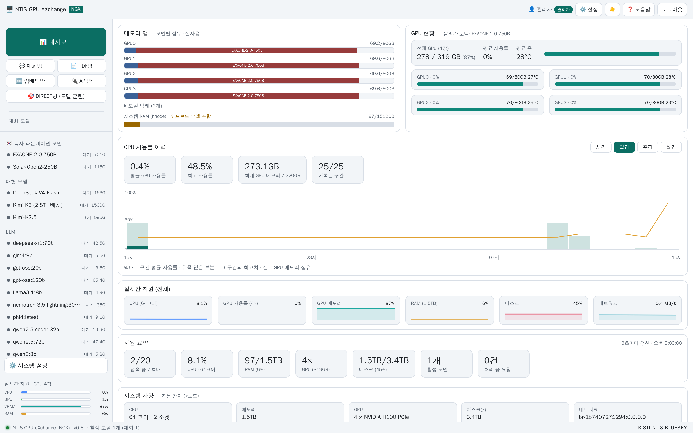

# NGX — NTIS GPU eXchange

[한국어](README.md) | **English**

**A multi-user GPU resource broker and model operations platform**

NGX unifies model loading and unloading, inference serving, document parsing, embedding,
supervised fine-tuning (SFT), and usage accounting behind a single web interface and REST API,
running on a single node or across several GPU nodes.

> ### 🌐 Now available as an agent on **TAW**
>
> **NGX** can now be reached as an **agent** on the **[The Agents Web (TAW)](https://github.com/leeryong/The_Agents_Web_TAW/blob/main/README.md)** platform.
> Nothing to install — the **TAW Browser** alone gets you there from **any device**
> (Windows · macOS · Linux · iOS · Android), **through conversation or as a web app**.
>
> A GPU node sitting on an institutional network can be **operated from outside it** — loading and
> releasing models, running conversations, and checking utilisation no longer require being at the desk.
>
> ➡️ **[The Agents Web (TAW)](https://github.com/leeryong/The_Agents_Web_TAW/blob/main/README.md)** · 🌌 **[KISTI · BLUESKY](https://github.com/leeryong/KISTI_BLUESKY)**

---

## 1. Background

A GPU node has a fixed amount of memory, while the models an organization wants to run
add up to considerably more. The two common ways of dealing with this each fail in their own way.

| Approach | Limitation |
|---|---|
| Static per-user GPU assignment | No single user's share is large enough to hold a large model, so nobody can run one |
| First-come, shared usage | Nothing shows what is currently loaded, so resources are returned late and queues build up |

NGX treats GPUs as **capacity that is claimed when needed and released when finished.**
What is loaded, who holds it, and how much room is left are visible at all times, and both
loading and unloading are done from the interface.

---

## 2. Capabilities

### 2.1 Model lifecycle

**Admission control**
When a load is requested, the model's memory requirement is checked against free capacity per GPU
before anything starts. A model that needs several GPUs is only admitted once that many cards are
available; otherwise the request is refused with the shortfall stated.

**Readiness tracking**
Loaded models are polled for serving readiness. The interval where a process has started but its
weights are not yet resident is reported as a distinct state, and instances that die are reclaimed
on the next refresh.

**Multiple instances**
The same model can be loaded more than once to raise concurrent throughput. Where the serving
engine supports slot-level parallelism this is done by adjusting slots; otherwise by adding
instances. Instances can be released individually or all at once.

**Memory visibility**
Per-GPU occupancy is reported as **reserved versus actually resident.** Serving engines commonly
reserve more than they use, so both figures are needed to judge what capacity remains.
Process-level occupancy is resolved to the work that process is performing rather than shown as
a bare process name.

### 2.2 Inference serving

**Endpoints**
Loaded models are exposed over an **OpenAI-compatible REST interface**, following the chat
completions and embeddings shapes, so existing clients and SDKs connect by changing the base URL
alone.

**Streaming**
Token-level streaming is supported. For models that emit their reasoning separately, the reasoning
trace and the final answer are delivered as distinct parts.

**Multimodal**
Vision-language models accept images alongside the prompt.

**Context handling**
Each model's maximum context length and recommended output budget are held as registry metadata,
and requests are validated against them before dispatch.

### 2.3 Document parsing

**Structure-preserving extraction**
PDF layout is analysed to separate body text, tables, formulas, and figures. Tables retain their
row and column structure; formulas retain their notation. Documents without a text layer are
routed through optical character recognition.

**Processing model**
Parsing runs asynchronously per document, with progress and per-page results available while it
proceeds. Output feeds directly into embedding and indexing.

### 2.4 Embedding

**Vector generation**
Sentence embedding models are loaded and served as a vector generation API. Multilingual,
Korean-specialised, and multimodal embedding models can be selected per use case.

**Batching and similarity**
Batches of sentences are processed in one call, and similarity between the resulting vectors can
be inspected directly in the interface. Dimensionality and normalisation follow the registry entry
for each model.

### 2.5 Fine-tuning (SFT)

**Job execution**
A dataset and training configuration are submitted, and the job is queued and run asynchronously.
GPUs are claimed when the job starts, arbitrated against concurrent serving workloads.

**Observation**
Training step, loss trajectory, and elapsed time are available live. Jobs can be cancelled, which
releases the held resources.

**Result**
A finished model can be registered and loaded immediately for evaluation.

### 2.6 Usage accounting and history

**Resource time series**
GPU utilisation and memory occupancy are sampled periodically, retained, and aggregated over
**hour, day, week, and month.** Each interval reports both its mean and its peak, so brief spikes
are distinguishable from sustained load.

**Per-model accounting**
Request counts and input and output token totals accumulate per model, showing which models
actually generate load and whether keeping one resident is justified.

**Per-user accounting**
Sessions, models used, and request volumes accumulate per user.

### 2.7 Access control

**Authentication**
Both web sessions and **API keys** are supported. Keys are issued and revoked per user and carry
the same permission scope as the interface.

**Permission separation**
Models are grouped into categories (chat, embedding, document, training, and so on) and each user
is granted access per category. Loading, unloading, and system configuration are reserved to
operators.

---

## 3. Characteristics

| Property | Detail |
|---|---|
| Hardware independence | Not tied to a particular GPU model or card count |
| Resource efficiency | Unloading idle models keeps capacity from being held needlessly |
| Operational visibility | What is loaded, by whom, and what remains are visible live |
| Interoperability | OpenAI-compatible shapes let existing clients connect unchanged |
| Consolidation | Serving, parsing, embedding, and training run on one platform |
| Traceability | Per-model and per-user usage history is retained |

---

## 4. Where it fits

- Research groups **sharing GPU nodes** across a team
- Workloads that need large models **loaded intermittently** rather than permanently
- Pipelines that turn **document collections into text and vectors**
- Teams **fine-tuning open models on their own data**

---

## 5. Details

| | |
|---|---|
| **Operated by** | Korea Institute of Science and Technology Information (KISTI) · NTIS-BLUESKY |
| **Version** | v0.8 |
| **Access** | Institutional network · contact the operator for connection details |
| **License** | Proprietary · source not disclosed ([LICENSE](LICENSE)) |

> **About this repository**
> This repository exists to **introduce NGX.** Source code, installation procedures, and internal
> composition are not published. Executable distributions may be released in future under separate
> terms of use.

---

## 👨‍💻 Development

**KISTI-NTIS BLUESKY Team** — Harmonizing Human and AI Collaboration
[github.com/leeryong/KISTI_BLUESKY](https://github.com/leeryong/KISTI_BLUESKY)

- Yong Lee ([ryonglee@kisti.re.kr](mailto:ryonglee@kisti.re.kr))

## 📞 Contact

- Yong Lee ([ryonglee@kisti.re.kr](mailto:ryonglee@kisti.re.kr))
